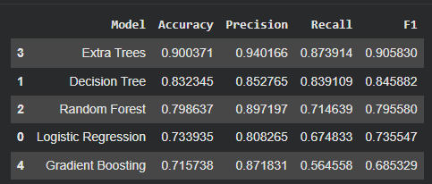
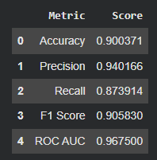
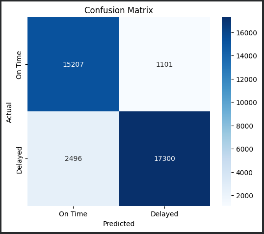
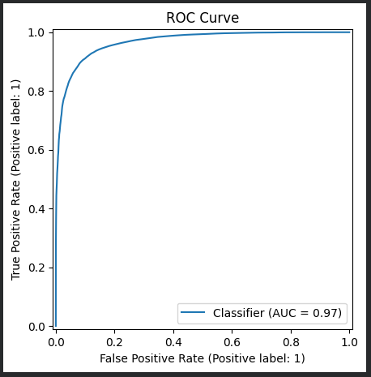
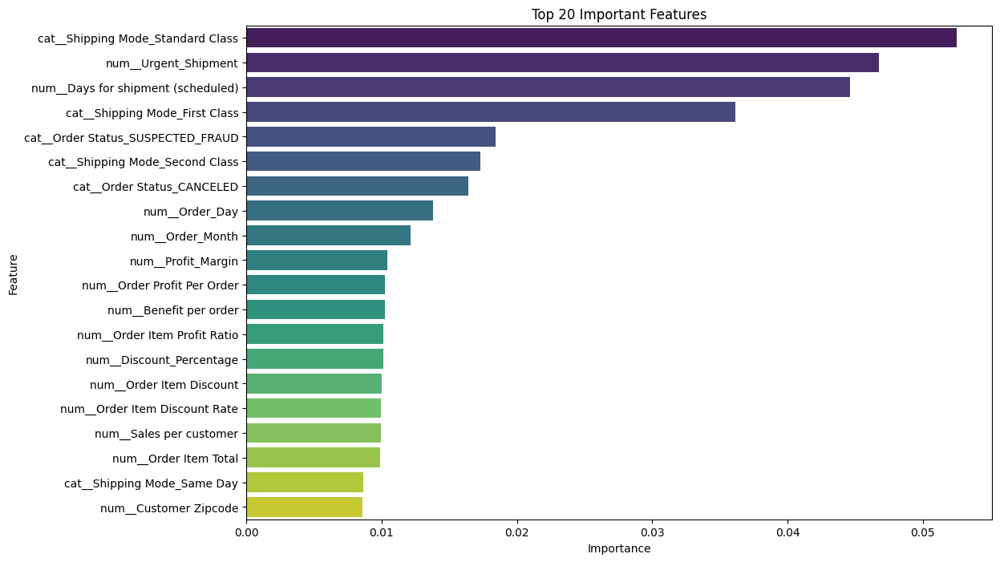

# 🚚 AI-Powered Supply Chain Risk Intelligence System

Predict shipment delivery risk using Machine Learning to help logistics companies identify high-risk shipments before dispatch.

---

## 📌 Overview

This project develops an end-to-end Machine Learning pipeline to predict **Late Delivery Risk** using the **DataCo Supply Chain Dataset (180K+ records)**. The solution includes data preprocessing, feature engineering, model comparison, and performance evaluation to support data-driven logistics decisions.

---

## 🚀 Features

- 📊 Exploratory Data Analysis (EDA)
- 🧹 Data Cleaning & Preprocessing
- ⚙️ Feature Engineering
- 🤖 Multiple ML Model Comparison
- 
- 🌲 Extra Trees Classifier (Best Model)
- 📈 Model Evaluation
- 
- 
- 
- 🔍 Feature Importance Analysis
- 

---

## 🛠️ Tech Stack

- Python
- Pandas
- NumPy
- Scikit-learn
- Matplotlib
- Seaborn
- Jupyter Notebook

---

## 📂 Project Workflow

```
Dataset
   ↓
Data Cleaning
   ↓
EDA
   ↓
Feature Engineering
   ↓
Model Training
   ↓
Model Evaluation
   ↓
Feature Importance
```

---

## 📊 Models Compared

- Logistic Regression
- Decision Tree
- Random Forest
- Extra Trees Classifier
- Gradient Boosting

  

**🏆 Best Performing Model:** Extra Trees Classifier

---

## 📁 Repository Structure

```
├── notebooks/
├── images/
├── README.md
```

---

## 📈 Results

The Extra Trees Classifier achieved the best performance in predicting shipment delay risk, with feature importance analysis identifying the key factors influencing delayed deliveries.

---

## 🔮 Future Improvements

- FastAPI Deployment
- React Dashboard
- SHAP Explainability
- Hyperparameter Optimization
- Cloud Deployment

---

⭐ If you found this project interesting, consider giving it a star!
